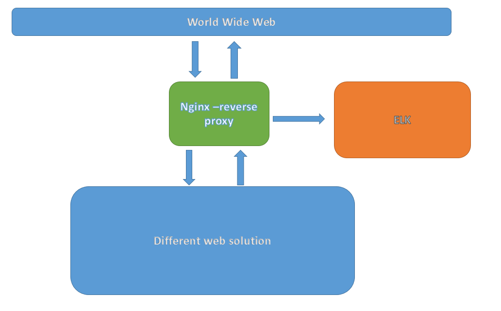

# This repository contains the source code for the cc-revisionlog solution.

### For being able to run these docker images locally you might need to follow this tutorial: [DED0033 - CC Development Environment Installation Manual](https://bitbucket/projects/ENET/repos/environment/browse/docs/DED0033-Development-environment-installation-manual.md)

The demo-app will be running at [http://localhost:5000](http://localhost:5000), and the results of the demo-app will be at [http://localhost:5001](http://DOCKER_MACHINE_IP_ADDRESS:5001).
The nginx reverse proxy will be running at [http://{DOCKER_MACHINE_IP_ADDRESS}:8080](http://localhost:8080) and it will forward your requests on port 5050 (to the demo-app).

Architecture
-----

* A Python webapp which lets you vote between two options
* A Redis queue which collects new votes
* A .NET worker which consumes votes and stores them in…
* A Postgres database backed by a Docker volume
* A Node.js webapp which shows the results of the voting in real time

